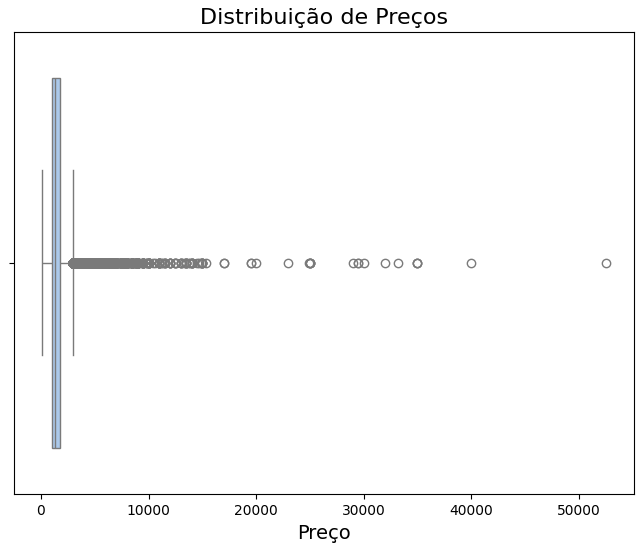

## Projeto de Data Science: Análise de Imóveis para Aluguel nos Estados Unidos

Descrição do Projeto
Este projeto tem como objetivo analisar imóveis para aluguel nos Estados Unidos, com foco na identificação das comodidades mais relevantes para o preço e localização de maior valor. Através de técnicas de Machine Learning, segmentação de mercado e análise de padrões, foi possível gerar insights valiosos sobre o comportamento do mercado imobiliário.

**Principais Ferramentas Utilizadas**
- **Linguagem**: Python
- **Bibliotecas**:
  - `Pandas`: Para manipulação e análise de dados estruturados.
  - `NumPy`: Para operações matemáticas.
  - `Matplotlib` e `Seaborn`: Para visualização gráfica de dados.
  - `Scikit-learn`: Para modelagem estatística, regressão e análise preditiva.

**Descrição do Projeto**
O objetivo principal deste projeto é analisar o mercado de aluguéis de apartamentos para a empresa fictícia Liberty Apartments. O foco está em identificar os fatores que influenciam o preço dos aluguéis em três cidades principais nos EUA. A análise foi estruturada para responder a cinco questões fundamentais levantadas pela empresa.

### Objetivos da Análise
1. **Relação entre preço e tamanho do apartamento**:
   - Foi realizado um estudo de correlação e análise de regressão linear entre a metragem quadrada e o preço de aluguel em cada cidade, com o objetivo de identificar padrões entre as localidades.
   
2. **Impacto da localização no preço**:
   - O dataset inclui dados geográficos que foram utilizados para segmentar as cidades em bairros ou áreas, permitindo um estudo da variação dos preços de aluguel com base na localização.

3. **Análise de amenidades**:
   - Uma análise foi conduzida para identificar quais amenidades, como estacionamento, academia, varanda, etc., mais influenciam no valor do aluguel em cada cidade.

4. **Principais fatores determinantes do preço**:
   - Usando técnicas de análise multivariada e regressão, foi identificada a influência de múltiplos fatores, como localização, metragem e amenidades, sobre o preço final do aluguel.

5. **Segmentação do mercado**:
   - Clusters de imóveis foram identificados com base em características similares, permitindo segmentar o mercado em diferentes grupos.

### Análises Realizadas
- **Análise descritiva**:
  - Um resumo estatístico dos dados foi gerado, incluindo a média, mediana e dispersão dos preços de aluguel.
  
- **Visualização de dados**:
  - Gráficos de dispersão e boxplots foram utilizados para explorar a distribuição dos preços, a correlação com o tamanho dos imóveis e a distribuição geográfica dos preços dentro de cada cidade.
  
- **Clusterização**:
  - Técnicas de agrupamento foram utilizadas para identificar grupos homogêneos de apartamentos com base em suas características e valores de aluguel.

**Como Reproduzir o Projeto**
1. Clone o repositório.
   ```bash
   git clone https://github.com/seu_repositorio/projeto-liberty-apartments.git
   ```
   
2. Instale as dependências.
   ```bash
   pip install -r requirements.txt
   ```

3. Execute o Jupyter Notebook para visualizar as análises.
   ```bash
   jupyter notebook 10k.ipynb
   ```


### Estrutura do Repositório
```
/projeto-liberty-apartments
│
├── data/                # Diretório com os dados brutos
├── notebooks/           # Jupyter notebooks com as análises
├── src/                 # Scripts auxiliares
├── README.md            # Este arquivo
├── requirements.txt     # Dependências do projeto
└── LICENSE              # Licença do projeto
```

### Empresa Imobiliária Fictícia Liberty Apartments

A Liberty Apartments é uma empresa imobiliária dos Estados Unidos que se especializa na locação de apartamentos residenciais em diversas cidades. Seu objetivo é conectar locatários a imóveis que atendam às suas necessidades, oferecendo informações detalhadas e um processo de locação eficiente.

Cada imóvel disponível possui um identificador único e dados geográficos precisos, incluindo localização exata e a cidade onde se encontra. A empresa classifica os imóveis com base em suas características, como número de quartos, banheiros e metragem, além de listar amenidades adicionais.

Os preços de aluguel são fornecidos de forma clara, acompanhados de possíveis taxas. A empresa também informa se há fotos dos imóveis e se animais de estimação são permitidos. Essas informações são organizadas de maneira estruturada e sem lacunas, permitindo análises eficientes e precisas para otimizar o processo de locação.

Dessa forma, a "Liberty Apartments" utiliza os dados coletados para melhorar a experiência dos clientes e aprimorar suas operações no mercado imobiliário dos EUA.


**Demanda para a Equipe de Cientistas de Dados da Liberty Apartments: Foco nas Três Principais Cidades**

Estamos buscando uma análise aprofundada dos fatores que afetam os preços dos aluguéis nas três principais cidades onde atuamos.

1. **Como o preço varia com o tamanho do apartamento em cada cidade?**: Precisamos entender como o tamanho dos apartamentos influencia o preço dos aluguéis em nossas três principais cidades. A ideia é verificar se, em cada localidade, há uma correlação clara entre a metragem quadrada e o valor do aluguel, e se essa relação é semelhante ou diferente entre as cidades.
2. **Como a localização dentro de cada cidade impacta o preço?**: Queremos identificar os padrões de preço com base em diferentes bairros e áreas dentro de cada cidade. A análise deve nos mostrar quais regiões têm os aluguéis mais altos ou mais baixos e quais fatores locais, como proximidade de centros comerciais ou áreas valorizadas, afetam esses preços. É importante compreender as particularidades de cada cidade para ajustar nossas estratégias de precificação.
4. **Quais são os principais fatores que determinam o preço em cada cidade?**: Queremos descobrir quais fatores – seja o tamanho, a localização ou as amenidades – têm mais impacto na formação dos preços dos aluguéis em cada uma das três cidades. Isso nos ajudará a ajustar nossa oferta de acordo com o que realmente importa para os inquilinos em cada região.
5. **Existe algum padrão entre os imóveis que possa nos ajudar a segmentar o mercado em cada cidade?**: Precisamos entender se há grupos de imóveis com características e preços semelhantes dentro de cada cidade. Identificar esses padrões nos permitirá criar estratégias específicas para cada grupo, oferecendo imóveis mais alinhados ao perfil e às expectativas dos inquilinos.

### Análise do Dataset 

O Primeiro passo é identificar e entendeder os dados que estamos trabalhando. 

Para responder a primeira solicitação, preciso entender como é a distribuição de preços de apartamentos em todo o dataset. 

Aqui podemos observar que existem muitos outliers no dataset, isso em si já vai ser uma informação importante futuramente mas no momento quero descobrir a distribuição dos quartis, então vou diminuir esses outliers. 

Como pedido, faço uma contagem no dataset e descubro que as três cidades com mais apartamentos são: Dallas, Denver e Los Angeles.

Bom, primeiro quero apenas observar graficamente a distribuição de preços de acordo com o tamanho dos apartamentos. Faço isso para as três cidades.   

Após isso, penso em utilizar uma Regressão Linear para identificar mais precisamente a relação dessas variáveis.   

Através da função de custo percebo um grande erro na predição, mas isso ja era esperando tendo em conta a grande quantidade de outliers, a ideia era identificar alguma relação entre tamanho e valor e é possivel perceber que sim, há uma relação, porém existem outros fatores que podem se mostrar mais influentes, vamos continuar!

A segunda demanda pede para verificarmos como a localização afeta o preço, e para isso vamos fazer uma analise para cada cidade.

### Dallas

Obs: Para essa análise, coloquei dois tipos de marcadores:
   - `Azul`: Preços acima do preço médio dos apartamentos da cidade
   - `Vermelho`: Preços abaixo do preço médio dos apartamentos da cidade

Em Dallas, podemos observar que os apartamentos da zona sul e zona leste da cidade estão abaixo da média de preço, enquanto apartamentos do centro da cidade e alguns da zona norte estão acimda da média de preço. 


### Denver 

Em Denver, podemos observar que os apartamentos da zona norte e zona oeste da cidade estão abaixo da média de preço, enquanto apartamentos do centro da cidade e alguns da zona sul e leste estão acimda da média de preço. 


### Los Angeles

Fugindo do padrão, a concentração de apartamentos com o preço acima da média se encontra ao oeste da cidade, tendo alguns outros se encontrando no centro da cidade. 


**Conclusões**
   - Dallas
      - Zonas de maior valor: Centro, Norte
      - Zonas de menor valor: Sul, Leste
   - Denver
      - Zonas de maior valor: Sul, Leste
      - Zonas de menor valor: Norte, Oeste
   - Los Angeles
      - Zonas de maior valor: Oeste, Centro


Passando para a próxima demanda, queremos descobrir agora quais fatores mais impactam no preço do apartamento, para isso decidi utilizar o algoritmo de Random Forest e cheguei no seguinte resultado: 

`obs`: Para fazer esse treinamento foi necessário categorizar os preços em três catergorias.

Feito o treinamento e com uma acurácia alta, podemos verificar quais são as features que mais impactam no preço. 


**Conclusões**
   - Features que mais impactam: 1.Localização e 2.Tamanho


Agora vamos identificar os padrões desses imovés e separalos em clusters. 

### Padrões


